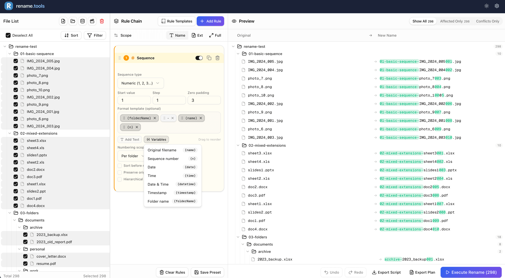

<div align="center">

# Rename.Tools

**A powerful browser-based batch file renaming tool.**

Regex, rule chains, live preview — all processed locally for total privacy.

[](https://github.com/chenz24/rename.tools/blob/main/LICENSE)
[](https://github.com/chenz24/rename.tools)

[Live Demo](https://rename.tools) · [Report Bug](https://github.com/chenz24/rename.tools/issues) · [Request Feature](https://github.com/chenz24/rename.tools/issues)

English | [简体中文](./README_zh.md)

</div>

---

## ✨ Features

- **100% Local Processing** — Files never leave your device. All operations run in-browser via File System Access API.
- **Rule Chains** — Combine multiple rename rules (Find & Replace, Regex, Sequence, Case/Style, Custom JS) in sequence.
- **Live Preview** — See changes instantly as you configure rules. Conflicts are detected before execution.
- **Metadata Support** — Extract EXIF data from images and audio tags from music files for smart renaming.
- **TV Show Scraper** — Auto-match video files with show/episode info from TMDb (requires internet and a TMDb API key).
- **Export Scripts** — Generate bash or PowerShell scripts for offline execution.
- **Undo Support** — Built-in undo in the UI, plus exportable undo scripts for command-line rollback.
- **Works Offline** — No internet needed after initial page load. (Note: TV show scraping requires internet and a TMDb API key)
- **Multi-language** — English and Chinese supported.

## 🖼️ Screenshot



## 🚀 Getting Started

### Prerequisites

- Node.js >= 20 (see `.nvmrc`)
- pnpm

### Installation

```bash
# Clone the repository
git clone https://github.com/chenz24/rename.tools.git
cd rename.tools

# Install dependencies
pnpm install

# Copy environment variables
cp .env.example .env.local

# Start development server
pnpm dev
```

Open [http://localhost:3000](http://localhost:3000) to see the app.

## 🛠️ Tech Stack

| Category | Technology |
|----------|------------|
| **Framework** | [Next.js 16](https://nextjs.org) (App Router, Turbopack) |
| **UI** | [React 19](https://react.dev), [Tailwind CSS 4](https://tailwindcss.com), [shadcn/ui](https://ui.shadcn.com) |
| **State** | [Zustand](https://zustand-demo.pmnd.rs/) |
| **Drag & Drop** | [@dnd-kit](https://dndkit.com/) |
| **Metadata** | [exifr](https://github.com/MikeKovaworker/exifr), [music-metadata-browser](https://github.com/Borewit/music-metadata-browser) |
| **i18n** | [next-intl](https://next-intl.dev) |
| **Linting** | [Biome](https://biomejs.dev) |
| **Language** | TypeScript |

## 📖 Usage

### Quick Start

1. **Import Files** — Drag & drop files/folders or use the file picker
2. **Add Rules** — Build a rule chain with multiple rename operations
3. **Preview** — Review changes in real-time with conflict detection
4. **Execute** — Rename files directly on your device

### Available Rule Types

| Rule | Description |
|------|-------------|
| **Find & Replace** | Text replacement with case sensitivity and position options |
| **Regex Replace** | Full regex support with capture groups and backreferences |
| **Add/Insert** | Insert text at start, end, or specific position |
| **Sequence** | Auto-numbering with custom start, step, and padding |
| **Case/Style** | UPPERCASE, lowercase, Title Case, kebab-case, etc. |
| **Remove/Cleanup** | Remove characters by count, range, or type (digits, symbols, etc.) |
| **Custom JS** | Write your own transform function |

### Template Variables

Use variables in Insert rules:

- `{name}` — Original filename
- `{n}` — Sequence number
- `{date}`, `{time}`, `{datetime}` — Current date/time
- `{exifDate}`, `{exifCamera}` — EXIF metadata
- `{mediaArtist}`, `{mediaTitle}`, `{mediaAlbum}` — Audio tags

## 🌐 Browser Support

| Browser | Direct Rename | Export Scripts |
|---------|--------------|----------------|
| Chrome / Edge / Brave / Arc | ✅ | ✅ |
| Firefox / Safari | ❌ | ✅ |

> Direct renaming requires the File System Access API (Chromium-based browsers). Other browsers can use sample test mode or export scripts.

## 📦 Scripts

| Command | Description |
|---------|-------------|
| `pnpm dev` | Start dev server with Turbopack |
| `pnpm build` | Build for production |
| `pnpm start` | Start production server |
| `pnpm lint` | Lint with Biome |
| `pnpm format` | Format with Biome |
| `pnpm check` | Lint + format (auto-fix) |

## 🔒 Privacy

Rename.Tools is built with a **privacy-first architecture**:

- **No uploads** — Files are accessed via browser APIs, never transmitted
- **No server processing** — All rename logic runs client-side
- **No data retention** — Close the tab and everything is gone
- **No accounts** — No sign-up, no tracking, no analytics on your files

## ❓ FAQ

**Is Rename.Tools really free?**
Yes, completely free and open source. There are no premium tiers, no trials, and no hidden fees.

**Do my files get uploaded to a server?**
No. Rename.Tools runs entirely in your browser. Your files are accessed through the File System Access API and never leave your device.

**What browsers are supported?**
Rename.Tools works best in Chromium-based browsers (Chrome, Edge, Brave, Arc). Firefox and Safari can use sample test mode or export scripts.

**Can I undo a rename operation?**
Yes. Rename.Tools provides a built-in undo button in the interface to reverse your last rename operation. You can also export an undo script for command-line reversal if needed.

**How many files can it handle?**
Rename.Tools can handle thousands of files in a single batch. Performance depends on your browser and device capabilities.

**Does it work completely offline?**
Most features work offline after initial page load. However, the TV show scraping feature requires internet access and a TMDb API key to query the TMDb API.

## 🤝 Contributing

Contributions are welcome! Please feel free to submit a Pull Request.

1. Fork the project
2. Create your feature branch (`git checkout -b feature/amazing-feature`)
3. Commit your changes (`git commit -m 'Add some amazing feature'`)
4. Push to the branch (`git push origin feature/amazing-feature`)
5. Open a Pull Request

## 📄 License

This project is licensed under the AGPL-3.0 License — see the [LICENSE](LICENSE) file for details.

## 🙏 Acknowledgments

- [shadcn/ui](https://ui.shadcn.com) for the beautiful components
- [TMDb](https://www.themoviedb.org) for TV show data API
- All contributors who help improve this project

---

<div align="center">

**[⬆ Back to Top](#renametools)**

Made with ❤️ by [chenz24](https://github.com/chenz24)

</div>
