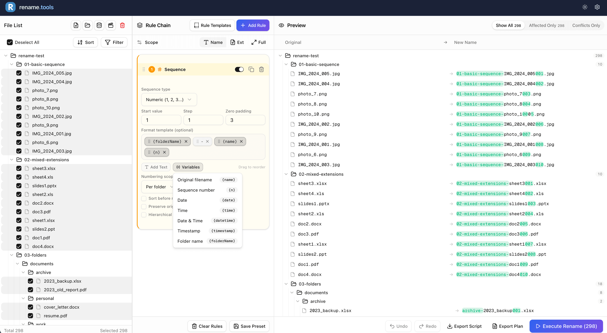

<div align="center">

# Rename.Tools

**浏览器端批量文件重命名工具 / A powerful browser-based batch file renaming tool.**

支持正则表达式、规则链和实时预览，所有处理都在本机完成。<br>
Regex, rule chains, and live preview, with all processing handled locally for complete privacy.

[](https://github.com/chengtao666/rename.tool-zh/blob/main/LICENSE)
[](https://github.com/chengtao666/rename.tool-zh)

[在线体验 / Live Demo](https://rename.tools) · [反馈问题 / Report Bug](https://github.com/chengtao666/rename.tool-zh/issues) · [功能建议 / Request Feature](https://github.com/chengtao666/rename.tool-zh/issues)
·[下载方式/ Download Link](https://github.com/chengtao666/rename.tool-zh/releases/tag/windows)

</div>

---

## 项目简介 / Overview

Rename.Tools 是一款功能完整的浏览器端批量重命名工具。你可以把多条处理规则组合成规则链，在操作前实时预览结果，并直接将改动应用到本机文件。文件不会上传到服务器，重命名过程完全在本地完成。<br>
Rename.Tools is a full-featured batch file renaming tool that runs in your browser. Combine multiple rename operations into a rule chain, preview every change before applying it, and rename files directly on your device. Files are never uploaded to a server.

该软件已由@chengtao666打包成便携版，可在windows本地使用。链接：https://github.com/chengtao666/rename.tool-zh/releases/tag/windows
## 功能亮点 / Features

- **全程本地处理 / 100% Local Processing**<br>
  文件始终保留在你的设备上，所有操作都通过浏览器的 File System Access API 完成。<br>
  Files stay on your device, and all operations run in the browser through the File System Access API.

- **规则链 / Rule Chains**<br>
  按顺序组合查找替换、正则替换、序号、大小写转换和自定义 JavaScript 等多种规则。<br>
  Combine Find & Replace, Regex, Sequence, Case/Style, and Custom JavaScript rules in sequence.

- **实时预览 / Live Preview**<br>
  配置规则时即时查看新文件名，并在执行前发现冲突。<br>
  See the resulting filenames as you configure rules and catch conflicts before execution.

- **元数据读取 / Metadata Support**<br>
  提取图片的 EXIF 信息以及音乐文件的音频标签，用于智能命名。<br>
  Extract EXIF data from images and audio tags from music files for smarter naming.

- **剧集信息匹配 / TV Show Matching**<br>
  根据 TMDb 数据自动识别视频对应的剧集信息，需要联网并配置 TMDb API Key。<br>
  Match video files with show and episode information from TMDb. This feature requires internet access and a TMDb API key.

- **导出脚本 / Script Export**<br>
  生成 bash 或 PowerShell 脚本，便于离线执行。<br>
  Generate bash or PowerShell scripts for offline execution.

- **撤销操作 / Undo Support**<br>
  界面内置撤销按钮，也可以导出撤销脚本，通过命令行恢复文件名。<br>
  Use the built-in undo action in the UI, or export an undo script for command-line rollback.

- **支持离线使用 / Offline Support**<br>
  首次加载页面后，大多数功能无需联网即可使用。剧集信息匹配功能除外。<br>
  Most features work offline after the initial page load. TV show matching is the exception.

- **多语言界面 / Multi-language UI**<br>
  支持简体中文和英文。<br>
  English and Simplified Chinese are supported.

## 界面截图 / Screenshot



## 开始使用 / Getting Started

### 环境要求 / Prerequisites

- Node.js >= 20，具体版本参见 `.nvmrc`。<br>
  Node.js >= 20. See `.nvmrc` for the expected version.
- pnpm

### 安装步骤 / Installation

```bash
# 克隆仓库 / Clone the repository
git clone https://github.com/chengtao666/rename.tool-zh.git
cd rename.tool-zh

# 安装依赖 / Install dependencies
pnpm install

# 复制环境变量文件 / Copy environment variables
cp .env.example .env.local

# 启动开发服务器 / Start the development server
pnpm dev
```

浏览器打开 [http://localhost:3000](http://localhost:3000) 即可使用。<br>
Open [http://localhost:3000](http://localhost:3000) to use the app.

### 构建桌面版 / Desktop Builds

在 Windows 上构建便携版：<br>
Build the portable Windows version:

```bash
pnpm desktop:build
```

在 macOS 上构建 DMG 和 ZIP 安装包：<br>
Build the macOS DMG and ZIP packages:

```bash
pnpm desktop:build:mac
```

## 技术栈 / Tech Stack

| 分类 / Category | 技术 / Technology |
|-----------------|-------------------|
| **框架 / Framework** | [Next.js 16](https://nextjs.org)（App Router、Turbopack） |
| **界面 / UI** | [React 19](https://react.dev)、[Tailwind CSS 4](https://tailwindcss.com)、[shadcn/ui](https://ui.shadcn.com) |
| **状态管理 / State** | [Zustand](https://zustand-demo.pmnd.rs/) |
| **拖拽交互 / Drag & Drop** | [@dnd-kit](https://dndkit.com/) |
| **元数据 / Metadata** | [exifr](https://github.com/MikeKovaworker/exifr)、[music-metadata-browser](https://github.com/Borewit/music-metadata-browser) |
| **国际化 / i18n** | [next-intl](https://next-intl.dev) |
| **代码检查 / Linting** | [Biome](https://biomejs.dev) |
| **开发语言 / Language** | TypeScript |

## 使用方法 / Usage

### 快速上手 / Quick Start

1. **导入文件 / Import Files**<br>
   拖入文件或文件夹，也可以通过文件选择器添加。<br>
   Drag and drop files or folders, or use the file picker.

2. **添加规则 / Add Rules**<br>
   把多个重命名操作组合成一条规则链。<br>
   Build a rule chain with multiple rename operations.

3. **预览结果 / Preview**<br>
   实时查看新文件名，并检查是否存在冲突。<br>
   Review the changes in real time and check for conflicts.

4. **执行重命名 / Execute**<br>
   确认无误后，直接在本机完成重命名。<br>
   Rename the files directly on your device.

### 可用的重命名规则 / Available Rule Types

| 规则 / Rule | 说明 / Description |
|-------------|--------------------|
| **查找替换 / Find & Replace** | 替换指定文本，可选择是否区分大小写以及匹配位置。<br>Replace text with options for case sensitivity and match position. |
| **正则替换 / Regex Replace** | 支持完整正则表达式、捕获组和反向引用。<br>Full regular expression support with capture groups and backreferences. |
| **添加或插入 / Add/Insert** | 在文件名开头、结尾或指定位置插入文本。<br>Insert text at the start, end, or a specific position. |
| **序号 / Sequence** | 自动编号，可设置起始值、步长和补零位数。<br>Auto-number files with a custom start value, step, and padding. |
| **大小写与样式 / Case/Style** | 转换为大写、小写、标题格式、短横线格式等。<br>Convert to UPPERCASE, lowercase, Title Case, kebab-case, and more. |
| **移除与清理 / Remove/Cleanup** | 按数量、范围或字符类型删除内容，例如数字、符号等。<br>Remove characters by count, range, or type, such as digits and symbols. |
| **自定义 JavaScript / Custom JavaScript** | 编写自己的转换函数。<br>Write your own transform function. |

### 模板变量 / Template Variables

在“插入”规则中可以使用以下变量：<br>
Use these variables in Insert rules:

- `{name}`：原始文件名 / Original filename
- `{n}`：序号 / Sequence number
- `{date}`、`{time}`、`{datetime}`：当前日期或时间 / Current date or time
- `{exifDate}`、`{exifCamera}`：EXIF 元数据 / EXIF metadata
- `{mediaArtist}`、`{mediaTitle}`、`{mediaAlbum}`：音频标签 / Audio tags

## 浏览器兼容性 / Browser Support

| 浏览器 / Browser | 直接重命名 / Direct Rename | 导出脚本 / Export Scripts |
|------------------|----------------------------|----------------------------|
| Chrome / Edge / Brave / Arc | 支持 / Yes | 支持 / Yes |
| Firefox / Safari | 不支持 / No | 支持 / Yes |

> 直接重命名依赖 File System Access API，因此需要 Chromium 内核浏览器。其他浏览器可以使用示例测试模式，或导出脚本后执行。<br>
> Direct renaming requires the File System Access API, which is available in Chromium-based browsers. Other browsers can use sample test mode or export scripts.

## 常用命令 / Commands

| 命令 / Command | 说明 / Description |
|----------------|--------------------|
| `pnpm dev` | 启动 Turbopack 开发服务器。<br>Start the Turbopack development server. |
| `pnpm build` | 构建生产版本。<br>Build for production. |
| `pnpm start` | 启动生产服务器。<br>Start the production server. |
| `pnpm lint` | 使用 Biome 检查代码。<br>Lint with Biome. |
| `pnpm format` | 使用 Biome 格式化代码。<br>Format with Biome. |
| `pnpm check` | 检查并自动修复格式问题。<br>Lint and apply formatting fixes. |

## 隐私保护 / Privacy

Rename.Tools 采用隐私优先的设计：<br>
Rename.Tools is built with a privacy-first architecture:

- **不上传文件 / No Uploads**<br>
  文件通过浏览器 API 读取，不会发送到服务器。<br>
  Files are accessed through browser APIs and are never transmitted.

- **不进行服务端处理 / No Server-side Processing**<br>
  所有重命名逻辑都在客户端运行。<br>
  All rename logic runs on the client.

- **不留存数据 / No Data Retention**<br>
  关闭标签页后，相关数据随即消失。<br>
  Close the tab and the data is gone.

- **无需账号 / No Accounts**<br>
  无需注册，也不会追踪或分析你的文件。<br>
  No sign-up, tracking, or analysis of your files.

## 常见问题 / FAQ

### Rename.Tools 是免费的吗？ / Is Rename.Tools free?

是的。项目完全免费并且开源，没有付费版本、试用限制或隐藏费用。<br>
Yes. It is completely free and open source, with no premium tiers, trials, or hidden fees.

### 文件会被上传到服务器吗？ / Are my files uploaded to a server?

不会。Rename.Tools 完全在浏览器中运行，文件通过 File System Access API 访问，不会离开你的设备。<br>
No. Rename.Tools runs entirely in your browser. Files are accessed through the File System Access API and never leave your device.

### 支持哪些浏览器？ / Which browsers are supported?

推荐使用 Chrome、Edge、Brave 或 Arc 等 Chromium 内核浏览器。Firefox 和 Safari 可以使用示例测试模式，或导出脚本后执行。<br>
Rename.Tools works best in Chromium-based browsers such as Chrome, Edge, Brave, and Arc. Firefox and Safari can use sample test mode or export scripts.

### 可以撤销重命名吗？ / Can I undo a rename operation?

可以。界面提供撤销按钮，能够恢复上一次重命名操作。你也可以导出撤销脚本，通过命令行完成回滚。<br>
Yes. The interface includes an undo action for the most recent rename operation. You can also export an undo script for command-line rollback.

### 一次可以处理多少文件？ / How many files can it handle?

单次批量处理数千个文件没有问题，实际速度取决于浏览器性能和设备配置。<br>
Rename.Tools can handle thousands of files in one batch. Actual performance depends on your browser and device.

### 可以完全离线使用吗？ / Does it work completely offline?

首次加载页面后，大部分功能都能离线使用。剧集信息匹配功能需要联网访问 TMDb API，并配置 TMDb API Key。<br>
Most features work offline after the initial page load. TV show matching requires internet access and a TMDb API key.

## 参与贡献 / Contributing

欢迎提交代码、文档或问题反馈，也欢迎直接发起 Pull Request。<br>
Contributions are welcome. Feel free to submit a Pull Request.

1. Fork 本项目。 / Fork the project.
2. 创建功能分支：`git checkout -b feature/amazing-feature`。<br>
   Create a feature branch: `git checkout -b feature/amazing-feature`.
3. 提交修改：`git commit -m 'Add some amazing feature'`。<br>
   Commit your changes: `git commit -m 'Add some amazing feature'`.
4. 推送分支：`git push origin feature/amazing-feature`。<br>
   Push the branch: `git push origin feature/amazing-feature`.
5. 发起 Pull Request。 / Open a Pull Request.

## 开源许可 / License

本项目采用 AGPL-3.0 许可证，详情请查看 [LICENSE](LICENSE)。<br>
This project is licensed under the AGPL-3.0 License. See [LICENSE](LICENSE) for details.

## 致谢 / Acknowledgments

- [shadcn/ui](https://ui.shadcn.com) 提供界面组件 / for the UI components
- [TMDb](https://www.themoviedb.org) 提供剧集数据 API / for the TV show data API
- 所有参与改进本项目的贡献者 / Everyone who has helped improve this project

<div align="center">

**[返回顶部 / Back to Top](#renametools)**

</div>
